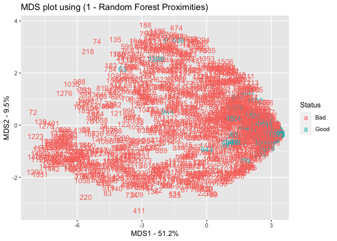

Red Wine Quality
================
Jin Seo Jo
26/09/2020

``` r
library(tidyverse)
library(dplyr)
library(scales)
```

``` r
wine_data <- read.csv("winequality-red.csv")
```

## Wine Quality

``` r
# Distribution of red wine quality ratings
ggplot(wine_data, aes(x = quality)) +
  geom_bar(stat = "count", position = "dodge", fill = "red") +
  ggtitle("Distribution of Red Wine Quality Ratings")
```

<!-- -->

## Distribution of good/bad wines

We will classify the wines by setting an arbitrary cutoff for our
dependent variable (wine quality) at e.g. 7 or higher getting classified
as ‘good/1’ and the remainder as ‘not good/0’.

``` r
# Create a variable indicating if a wine is good or bad
wine_data$good_bad_wine <- ifelse(wine_data$quality > 6, "Good", "Bad") %>% 
  factor()

summary(wine_data)
```

    ##  fixed.acidity   volatile.acidity  citric.acid    residual.sugar  
    ##  Min.   : 4.60   Min.   :0.1200   Min.   :0.000   Min.   : 0.900  
    ##  1st Qu.: 7.10   1st Qu.:0.3900   1st Qu.:0.090   1st Qu.: 1.900  
    ##  Median : 7.90   Median :0.5200   Median :0.260   Median : 2.200  
    ##  Mean   : 8.32   Mean   :0.5278   Mean   :0.271   Mean   : 2.539  
    ##  3rd Qu.: 9.20   3rd Qu.:0.6400   3rd Qu.:0.420   3rd Qu.: 2.600  
    ##  Max.   :15.90   Max.   :1.5800   Max.   :1.000   Max.   :15.500  
    ##    chlorides       free.sulfur.dioxide total.sulfur.dioxide    density      
    ##  Min.   :0.01200   Min.   : 1.00       Min.   :  6.00       Min.   :0.9901  
    ##  1st Qu.:0.07000   1st Qu.: 7.00       1st Qu.: 22.00       1st Qu.:0.9956  
    ##  Median :0.07900   Median :14.00       Median : 38.00       Median :0.9968  
    ##  Mean   :0.08747   Mean   :15.87       Mean   : 46.47       Mean   :0.9967  
    ##  3rd Qu.:0.09000   3rd Qu.:21.00       3rd Qu.: 62.00       3rd Qu.:0.9978  
    ##  Max.   :0.61100   Max.   :72.00       Max.   :289.00       Max.   :1.0037  
    ##        pH          sulphates         alcohol         quality      good_bad_wine
    ##  Min.   :2.740   Min.   :0.3300   Min.   : 8.40   Min.   :3.000   Bad :1382    
    ##  1st Qu.:3.210   1st Qu.:0.5500   1st Qu.: 9.50   1st Qu.:5.000   Good: 217    
    ##  Median :3.310   Median :0.6200   Median :10.20   Median :6.000                
    ##  Mean   :3.311   Mean   :0.6581   Mean   :10.42   Mean   :5.636                
    ##  3rd Qu.:3.400   3rd Qu.:0.7300   3rd Qu.:11.10   3rd Qu.:6.000                
    ##  Max.   :4.010   Max.   :2.0000   Max.   :14.90   Max.   :8.000

`good_bad_wine` tells us that only 217 out of 1599 wines is considered
as a good wine.

``` r
# Distribution of good/bad wines
ggplot(wine_data, aes(x = factor(1), fill = good_bad_wine)) +
  geom_bar(width = 1) +
  coord_polar("y") +
  labs(fill = "Wine quality") +
  theme_void()
```

<!-- -->

## Relationship between Physiochemical Properties and Wine Quality

Input variables (based on physiochemical
    tests):

``` r
ls(wine_data)
```

    ##  [1] "alcohol"              "chlorides"            "citric.acid"         
    ##  [4] "density"              "fixed.acidity"        "free.sulfur.dioxide" 
    ##  [7] "good_bad_wine"        "pH"                   "quality"             
    ## [10] "residual.sugar"       "sulphates"            "total.sulfur.dioxide"
    ## [13] "volatile.acidity"

### 1\. Fixed Acidity and Wine Quality

``` r
# From the 'wine_data', 
# select rows where 'good_bad_wine' is "Good" and recode column 'fixed.acidity'
wine_data$fixed.acidity[wine_data$good_bad_wine == "Good"]
```

    ##   [1]  7.3  7.8  8.5  8.1  7.5  8.0  5.4  9.6 12.8 12.8 11.0  5.2 15.0 15.0 10.0
    ##  [16] 11.8  7.9 10.3  8.9  7.7  8.9  8.7  8.7  9.8  9.8 11.6  7.9 11.9 12.5  6.6
    ##  [31] 10.5 11.9 12.8 12.8  9.4 11.5  9.4  9.6  5.6 12.0 12.0  9.9  9.5  6.6 10.5
    ##  [46]  6.6 10.5 12.6 15.6 10.0  5.3 10.4 11.3 10.4  9.4 11.6  9.2  8.9 10.7 10.7
    ##  [61] 10.4 10.4 10.5 10.5 10.2 10.4 13.3 10.5 10.5 12.9 12.0 11.8 11.1  5.0 10.2
    ##  [76]  9.4  7.7  7.8  8.7 12.0  9.3  5.1  8.2  8.4  8.2  4.9  7.5  7.8  6.7  6.7
    ##  [91] 10.1 11.1  7.6  8.2 11.7  9.1 10.4  8.8 10.7  8.3  8.3  7.4  7.4  6.8  6.8
    ## [106]  9.4  8.6  8.7  7.2  9.6  9.9 10.1  9.8  8.3 10.2 10.2  8.3  8.9  8.9  8.9
    ## [121]  8.3  8.2 10.2  6.4  9.0 10.1  8.8  7.0  9.8  5.6  5.6  7.5  9.9  9.1  6.8
    ## [136]  6.8  9.1  9.1  8.9  8.9  8.9  7.7  7.7  7.1  7.3 10.1  7.6  8.7  9.5  8.3
    ## [151]  8.9  9.9  8.9  9.1  6.6 11.1 11.1  9.3  9.1  7.9  7.9  8.5 11.6 11.6 10.0
    ## [166]  9.2  8.0  9.1  5.4  7.9  8.8  7.4  7.2  8.5 10.0  8.2  8.5  5.1 10.6  8.5
    ## [181]  8.2  7.1  7.2  7.9  8.6  7.2  7.2  7.2  7.2  6.2  5.1  5.5  9.8  9.1  7.0
    ## [196]  7.2  7.7  8.1  7.3  6.1  7.2  7.2  7.2  7.8  6.6  7.9  7.3  7.3  5.3  5.3
    ## [211]  6.4  6.6  7.4  8.4  7.4  7.0  6.7

``` r
# Find mean values
mean(wine_data$fixed.acidity[wine_data$good_bad_wine == "Good"])
```

    ## [1] 8.847005

``` r
mean(wine_data$fixed.acidity[wine_data$good_bad_wine == "Bad"])
```

    ## [1] 8.236831

``` r
ggplot(wine_data, aes(x = fixed.acidity, fill = good_bad_wine)) + 
  geom_density(alpha = 0.25) +
  # 'na.rm = TRUE' will remove NA values before the computation proceeds
  geom_vline(aes(xintercept = mean(fixed.acidity[good_bad_wine == "Good"], na.rm = TRUE)), 
             color = "red", linetype = "dashed", lwd = 1) +
  geom_vline(aes(xintercept = mean(fixed.acidity[good_bad_wine == "Bad"], na.rm = TRUE)), 
             color = "blue", linetype = "dashed", lwd = 1) +
  scale_x_continuous(breaks = seq(4, 16, 1)) +
  xlab(label = "Fixed Acidity Level") +
  labs(fill = "Wine Quality") +
  ggtitle("Distribution of Fixed Acidity Levels") +
  theme_classic()
```

<!-- -->

### 2\. Volatile Acidity and Wine Quality

``` r
ggplot(wine_data, aes(x = volatile.acidity, fill = good_bad_wine)) + 
  geom_density(alpha = 0.25) +
  geom_vline(aes(xintercept = mean(volatile.acidity[good_bad_wine == "Good"], na.rm = TRUE)), 
             color = "red", linetype = "dashed", lwd = 1) +
  geom_vline(aes(xintercept = mean(volatile.acidity[good_bad_wine == "Bad"], na.rm = TRUE)), 
             color = "blue", linetype = "dashed", lwd = 1) +
  scale_x_continuous(breaks = seq(4, 16, 1)) +
  xlab(label = "Volatile Acidity Level") +
  labs(fill = "Wine Quality") +
  ggtitle("Distribution of Volatile Acidity Levels") +
  theme_classic()
```

<!-- -->

\#\#\# 3. Citric Acid and Wine Quality

``` r
ggplot(wine_data, aes(x = citric.acid, fill = good_bad_wine)) + 
  geom_density(alpha = 0.25) +
  geom_vline(aes(xintercept = mean(citric.acid[good_bad_wine == "Good"], na.rm = TRUE)), 
             color = "red", linetype = "dashed", lwd = 1) +
  geom_vline(aes(xintercept = mean(citric.acid[good_bad_wine == "Bad"], na.rm = TRUE)), 
             color = "blue", linetype = "dashed", lwd = 1) +
  scale_x_continuous(breaks = seq(4, 16, 1)) +
  xlab(label = "Citric Acidity Level") +
  labs(fill = "Wine Quality") +
  ggtitle("Distribution of Citric Acidity Levels") +
  theme_classic()
```

<!-- -->

\#\#\# 4. Residual Sugar and Wine Quality

``` r
ggplot(wine_data, aes(x = residual.sugar, fill = good_bad_wine)) + 
  geom_density(alpha = 0.25) +
  geom_vline(aes(xintercept = mean(residual.sugar[good_bad_wine == "Good"], na.rm = TRUE)), 
             color = "red", linetype = "dashed", lwd = 1) +
  geom_vline(aes(xintercept = mean(residual.sugar[good_bad_wine == "Bad"], na.rm = TRUE)), 
             color = "blue", linetype = "dashed", lwd = 1) +
  scale_x_continuous(breaks = seq(4, 16, 1)) +
  xlab(label = "Residual Sugar Level") +
  labs(fill = "Wine Quality") +
  ggtitle("Distribution of Residual Sugar Levels") +
  theme_classic()
```

<!-- -->

Good and bad wines have very similar distributino of their corresponding
physiochemical properties.

### 5\. Chlorides and Wine Quality

``` r
ggplot(wine_data, aes(x = chlorides, fill = good_bad_wine)) + 
  geom_density(alpha = 0.25) +
  geom_vline(aes(xintercept = mean(chlorides[good_bad_wine == "Good"], na.rm = TRUE)), 
             color = "red", linetype = "dashed", lwd = 1) +
  geom_vline(aes(xintercept = mean(chlorides[good_bad_wine == "Bad"], na.rm = TRUE)), 
             color = "blue", linetype = "dashed", lwd = 1) +
  scale_x_continuous(breaks = seq(4, 16, 1)) +
  xlab(label = "Chlorides Level") +
  labs(fill = "Wine Quality") +
  ggtitle("Distribution of Chlorides Levels") +
  theme_classic()
```

<!-- -->

Good and bad wines have very similar distributino of their corresponding
physiochemical properties.

### 6\. Free Sulfur Dioxide and Wine Quality

``` r
ggplot(wine_data, aes(x = free.sulfur.dioxide, fill = good_bad_wine)) + 
  geom_density(alpha = 0.25) +
  geom_vline(aes(xintercept = mean(free.sulfur.dioxide[good_bad_wine == "Good"], na.rm = TRUE)), 
             color = "red", linetype = "dashed", lwd = 1) +
  geom_vline(aes(xintercept = mean(free.sulfur.dioxide[good_bad_wine == "Bad"], na.rm = TRUE)), 
             color = "blue", linetype = "dashed", lwd = 1) +
  scale_x_continuous(breaks = seq(4, 16, 1)) +
  xlab(label = "Free Sulfur Dioxide Level") +
  labs(fill = "Wine Quality") +
  ggtitle("Distribution of Free Sulfur Dioxide Levels") +
  theme_classic()
```

<!-- -->

Good and bad wines have very similar distributino of their corresponding
physiochemical
properties.

### 7\. Total Sulfur Dioxide and Wine Quality

``` r
ggplot(wine_data, aes(x = total.sulfur.dioxide, fill = good_bad_wine)) + 
  geom_density(alpha = 0.25) +
  geom_vline(aes(xintercept = mean(total.sulfur.dioxide[good_bad_wine == "Good"], na.rm = TRUE)), 
             color = "red", linetype = "dashed", lwd = 1) +
  geom_vline(aes(xintercept = mean(total.sulfur.dioxide[good_bad_wine == "Bad"], na.rm = TRUE)), 
             color = "blue", linetype = "dashed", lwd = 1) +
  scale_x_continuous(breaks = seq(4, 16, 1)) +
  xlab(label = "Total Sulfur Dioxide Level") +
  labs(fill = "Wine Quality") +
  ggtitle("Distribution of Total Sulfur Dioxide Levels") +
  theme_classic()
```

<!-- -->

Good and bad wines have very similar distributino of their corresponding
physiochemical properties.

### 8\. Density and Wine Quality

``` r
ggplot(wine_data, aes(x = density, fill = good_bad_wine)) + 
  geom_density(alpha = 0.25) +
  geom_vline(aes(xintercept = mean(density[good_bad_wine == "Good"], na.rm = TRUE)), 
             color = "red", linetype = "dashed", lwd = 1) +
  geom_vline(aes(xintercept = mean(density[good_bad_wine == "Bad"], na.rm = TRUE)), 
             color = "blue", linetype = "dashed", lwd = 1) +
  scale_x_continuous(breaks = seq(4, 16, 1)) +
  xlab(label = "Density Level") +
  labs(fill = "Wine Quality") +
  ggtitle("Distribution of Density Levels") +
  theme_classic()
```

<!-- -->

Good and bad wines have very similar distributino of their corresponding
physiochemical properties.

### 9\. pH and Wine Quality

``` r
ggplot(wine_data, aes(x = pH, fill = good_bad_wine)) + 
  geom_density(alpha = 0.25) +
  geom_vline(aes(xintercept = mean(pH[good_bad_wine == "Good"], na.rm = TRUE)), 
             color = "red", linetype = "dashed", lwd = 1) +
  geom_vline(aes(xintercept = mean(pH[good_bad_wine == "Bad"], na.rm = TRUE)), 
             color = "blue", linetype = "dashed", lwd = 1) +
  scale_x_continuous(breaks = seq(4, 16, 1)) +
  xlab(label = "pH Level") +
  labs(fill = "Wine Quality") +
  ggtitle("Distribution of pH Levels") +
  theme_classic()
```

<!-- -->

Good and bad wines have very similar distributino of their corresponding
physiochemical properties.

### 10\. Sulphates and Wine Quality

``` r
ggplot(wine_data, aes(x = sulphates, fill = good_bad_wine)) + 
  geom_density(alpha = 0.25) +
  geom_vline(aes(xintercept = mean(sulphates[good_bad_wine == "Good"], na.rm = TRUE)), 
             color = "red", linetype = "dashed", lwd = 1) +
  geom_vline(aes(xintercept = mean(sulphates[good_bad_wine == "Bad"], na.rm = TRUE)), 
             color = "blue", linetype = "dashed", lwd = 1) +
  scale_x_continuous(breaks = seq(4, 16, 1)) +
  xlab(label = "Sulphates Level") +
  labs(fill = "Wine Quality") +
  ggtitle("Distribution of Sulphates Levels") +
  theme_classic()
```

<!-- -->

Sulphates level of the wine shows the most discriminating attributes.

### 11\. Alcohol and Wine Quality

``` r
ggplot(wine_data, aes(x = alcohol, fill = good_bad_wine)) + 
  geom_density(alpha = 0.25) +
  geom_vline(aes(xintercept = mean(alcohol[good_bad_wine == "Good"], na.rm = TRUE)), 
             color = "red", linetype = "dashed", lwd = 1) +
  geom_vline(aes(xintercept = mean(alcohol[good_bad_wine == "Bad"], na.rm = TRUE)), 
             color = "blue", linetype = "dashed", lwd = 1) +
  scale_x_continuous(breaks = seq(4, 16, 1)) +
  xlab(label = "Alcohol Level") +
  labs(fill = "Wine Quality") +
  ggtitle("Distribution of Alcohol Levels") +
  theme_classic()
```

<!-- -->

Alchol level of the wine shows the most discriminating attributes.

**Interpretation**:  
\- We can see that `residual.sugar`, `chlorides`, `free.sulfur.dioxide`,
and `pH` have similar distributions. This means that `residual.sugar`,
`chlorides`, `free.sulfur.dioxide`, and `pH` does not effect on wine
quality.  
\- The most discriminating attributes we can observe are `sulphates` and
`alcohol` level of the wine. This shows that `sulphates` and `alcohol`
improve the quality of wine.

## Find the most important variables

Selecting the most important predictor variables that explains the major
part of variance of the reponse variable can be key to identify and
build high performing models.

### Random Forest Method

Random forest can be very effectve to find a set of predictors that best
explains the variance in the reponse variable.

Random forest are made out of decision trees.  
Decision Trees are easy to build, easy to use and easy to interpret, but
in practice they are not that awesome.  
Decision Trees work great with the data used to create them, but they
are not flecible when it comes to classifying new samples.  
Random Foressts combine the simplicity of decision trees with
flexibility resulting in a vast improvement in accuracy.

``` r
library(caret)
library(randomForest)
library(varImp)
```

``` r
str(wine_data)
```

    ## 'data.frame':    1599 obs. of  13 variables:
    ##  $ fixed.acidity       : num  7.4 7.8 7.8 11.2 7.4 7.4 7.9 7.3 7.8 7.5 ...
    ##  $ volatile.acidity    : num  0.7 0.88 0.76 0.28 0.7 0.66 0.6 0.65 0.58 0.5 ...
    ##  $ citric.acid         : num  0 0 0.04 0.56 0 0 0.06 0 0.02 0.36 ...
    ##  $ residual.sugar      : num  1.9 2.6 2.3 1.9 1.9 1.8 1.6 1.2 2 6.1 ...
    ##  $ chlorides           : num  0.076 0.098 0.092 0.075 0.076 0.075 0.069 0.065 0.073 0.071 ...
    ##  $ free.sulfur.dioxide : num  11 25 15 17 11 13 15 15 9 17 ...
    ##  $ total.sulfur.dioxide: num  34 67 54 60 34 40 59 21 18 102 ...
    ##  $ density             : num  0.998 0.997 0.997 0.998 0.998 ...
    ##  $ pH                  : num  3.51 3.2 3.26 3.16 3.51 3.51 3.3 3.39 3.36 3.35 ...
    ##  $ sulphates           : num  0.56 0.68 0.65 0.58 0.56 0.56 0.46 0.47 0.57 0.8 ...
    ##  $ alcohol             : num  9.4 9.8 9.8 9.8 9.4 9.4 9.4 10 9.5 10.5 ...
    ##  $ quality             : int  5 5 5 6 5 5 5 7 7 5 ...
    ##  $ good_bad_wine       : Factor w/ 2 levels "Bad","Good": 1 1 1 1 1 1 1 2 2 1 ...

``` r
sum(is.na(wine_data))
```

    ## [1] 0

We do not have any missing values, therefore we do not have to impute
values for the NAs in the dataset with ‘rfImput()’

``` r
# Fit the random forest
# We will remove 'quality' since 'good_bad_wine' is based on 'quality'
# We want the good_bad_wine column to be predicted by the data in all of the other columns except quality column
model <- randomForest(formula = good_bad_wine ~ . - quality, data = wine_data, proximity = TRUE)

model
```

    ## 
    ## Call:
    ##  randomForest(formula = good_bad_wine ~ . - quality, data = wine_data,      proximity = TRUE) 
    ##                Type of random forest: classification
    ##                      Number of trees: 500
    ## No. of variables tried at each split: 3
    ## 
    ##         OOB estimate of  error rate: 8.19%
    ## Confusion matrix:
    ##       Bad Good class.error
    ## Bad  1349   33  0.02387844
    ## Good   98  119  0.45161290

**Type of random forest** show athat the random forest was built to
classify samples.

**Number of trees** tells us how many trees are in the random forest.  
Note: The default value is 500.

**No. of variables tried at each split** tells us how many variables (or
columns of data) were considered at each internal node.  
Note: Classification trees have a default setting of the square root of
the number of variables. Regression trees have a default setting of the
number of variables divided by 3.

**OOB estimate of error rate** means that 92% of OOB(Out-of-Bag) samples
were correctly classified by the random forest.

**Confusion matrix**:  
\- There were 1348 bad quality wines that were correctly labeled “Bad”  
\- There were 98 good quality wines that were incorrectly classified
“Bad”  
\- There were 34 bad quality wines that were incorrectly classified
“Good”  
\- There were 119 good quality wines that were correctly classified
“Good”

To see if 500 trees is enough for optimal classification, we can plot
the error rates.

``` r
oob.error.data <- data.frame(
  Trees = rep(1:nrow(model$err.rate), times = 3),
  Type = rep(c("OOB", "Bad", "Good"), each = nrow(model$err.rate)),
  Error = c(model$err.rate[,"OOB"],
            model$err.rate[, "Bad"],
            model$err.rate[, "Good"]))
```

For the most part, this is all based on a matrix within `model` called
`err.rate`.

More detail on `err.rate`:

``` r
head(model$err.rate)
```

    ##            OOB        Bad      Good
    ## [1,] 0.1567657 0.10000000 0.5000000
    ## [2,] 0.1443299 0.09015421 0.5039370
    ## [3,] 0.1319967 0.08173077 0.4649682
    ## [4,] 0.1256506 0.06775300 0.5027933
    ## [5,] 0.1311933 0.07258065 0.5077720
    ## [6,] 0.1193830 0.06651199 0.4646465

  - There is one column for OOB error rate  
  - There is one column for the Bad error rate (i.e. how frequently bad
    wines are misclassified)  
  - There is one column for the Good error rate (i.e. how frequently
    good wines are misclassified)  
  - Each row reflects the error rates at different stages of creating
    the random forest.  
  - The first row contains the error rates after making the first
    tree.  
  - The second row contains the error rates after making the first two
    trees.  
  - The last row contians the error rates after making all 500 trees
    (i.e. default value)

More detail on `oob.error.data`:

``` r
head(oob.error.data)
```

    ##   Trees Type     Error
    ## 1     1  OOB 0.1567657
    ## 2     2  OOB 0.1443299
    ## 3     3  OOB 0.1319967
    ## 4     4  OOB 0.1256506
    ## 5     5  OOB 0.1311933
    ## 6     6  OOB 0.1193830

  - There is one column for the number of trees.  
  - There is one column for the type of error.  
  - There is one column for the actual error value.

Now we call `ggplot()`

``` r
ggplot(data = oob.error.data, aes(x = Trees, y = Error)) +
  geom_line(aes(color = Type))
```

<!-- -->

  - The green line shows the error rate when classifying good quality of
    wines.  
  - The blue line shows the overall OOB error rate.  
  - The red line shows the error rate when classifying bad quality of
    wines.  
  - In general, we see the error rates decrease when our random forest
    has more trees.  
  - And we see that the error rates stabilize right after 200 trees.  
  - So adding more trees didn’t help, but we would not have known this
    unless we used more trees.

Now we need to make sure we are considering the optimal number of
variables at each internal node in the tree.  
We start by making an empty vector that can hold 10 values.

``` r
oob.values <- vector(length = 10)
```

Then we create a loop that tests differnet numbers of variables at each
step.

``` r
# Each time we go through the loop, "i" increases by 1.
# It starts at 1 and ends after 10.
for(i in 1:10) {
  # We are building a random forest using "i" to determine the numebr of variables to try at each step
  # Specifically, we are setting 'mtry = i', and "i" equals values between 1 and 10
  temp.model <- randomForest(formula = good_bad_wine ~ . - quality, data = wine_data, mtry = i)
  # We store the OOB error rate after we build each random forest that uses a different value for mtry
  # temp.model contains a matrix called err.rate
  # And we want to access the value in the last row and in the first column
  # (i.e. the OOB error rate when all 500 trees have been made)
  oob.values[i] <- temp.model$err.rate[nrow(temp.model$err.rate), 1]
}
```

Print out the OOB error rates for different values for
    `mtry`

``` r
oob.values
```

    ##  [1] 0.08317699 0.08317699 0.08192620 0.08192620 0.08255159 0.08192620
    ##  [7] 0.08255159 0.08630394 0.08755472 0.08505316

  - The 3rd value, corresponding to `mtry = 3`, which is the default in
    this case, does not have the lowest OOB error rate.  
  - So the default value was not optimal.  
  - We need to choose the 2nd value since it has the lowest OOB error
    rate.

Make a new random forest
model:

``` r
new_model <- randomForest(formula = good_bad_wine ~ . - quality, data = wine_data, ntree = 200, mtry = 2, proximity = TRUE)

new_model
```

    ## 
    ## Call:
    ##  randomForest(formula = good_bad_wine ~ . - quality, data = wine_data,      ntree = 200, mtry = 2, proximity = TRUE) 
    ##                Type of random forest: classification
    ##                      Number of trees: 200
    ## No. of variables tried at each split: 2
    ## 
    ##         OOB estimate of  error rate: 8.19%
    ## Confusion matrix:
    ##       Bad Good class.error
    ## Bad  1356   26  0.01881331
    ## Good  105  112  0.48387097

Lastly, we want to use the random forest to draw an MDS plot with
samples.  
This will show us how they are related to each other.

We start by using `dist()` to make a distance matrix from 1-proximity
matrix.

``` r
distance.matrix <- dist(1 - new_model$proximity)
```

Then we run `cmdscale()` on the distance matrix.

``` r
# Classical Multidimensional Scaling
mds.stuff <- cmdscale(distance.matrix, eig = TRUE, x.ret = TRUE)
```

Then we calculate the percentage of variation in the distance matrix
that the X and Y axes account for.

``` r
mds.var.per <- round(mds.stuff$eig/sum(mds.stuff$eig)*100, 1)
```

Then we format the data for `ggplot()`

``` r
mds.values <- mds.stuff$points

mds.data <- data.frame(Sample = rownames(mds.values),
                       X = mds.values[,1],
                       Y = mds.values[,2],
                       Status = wine_data$good_bad_wine)
```

Draw the graph with `ggplot()`

``` r
ggplot(data = mds.data, aes(x = X, y = Y, label = Sample)) +
  geom_text(aes(color = Status)) +
  xlab(paste("MDS1 - ", mds.var.per[1], "%", sep = "")) +
  ylab(paste("MDS2 - ", mds.var.per[2], "%", sep = "")) +
  ggtitle("MDS plot using (1 - Random Forest Proximities)")
```

<!-- -->

  - We can see that Good sampels are on the right side.  
  - The X-axis accounts for 52.7% of the variation in the distance
    matrix.  
  - The y-axis only accounts for 8.9% of the variation in the distnace
    matrix.  
  - That means that the big differences are along the X-axis.

Variable importance:

``` r
# Get importance
importance <- importance(new_model)

varImportance <- data.frame(Variables = row.names(importance),
                            Importance = round(importance[, "MeanDecreaseGini"], 2))

# Create a rank variable based on importance
rankImportance <- varImportance %>% 
  mutate(Rank = paste0("#", dense_rank(desc(Importance))))

# Use ggplot2 to visulalize the relative importance of variables
ggplot(rankImportance, aes(x = reorder(Variables, Importance),
                           y = Importance, fill = Importance)) +
  geom_bar(stat = "identity") +
  geom_text(aes(x = Variables, y = 0.5, label = Rank),
            hjust = 0, vjust = 0.55, size = 4, color = "white") +
  labs(x = "Variables") +
  coord_flip() +
  theme_classic()
```

<!-- -->

## Data for correlation analysis

``` r
plot(wine_data)
```

<!-- -->

Computing correlation matrix

``` r
library(corrplot)
```

    ## corrplot 0.84 loaded

``` r
# Remove 'good_bad_wine' sinece this is not a numeric variable.
wine_data <- subset(wine_data, select = -good_bad_wine)

cr <- cor(wine_data)
head(round(cr, 2))
```

    ##                     fixed.acidity volatile.acidity citric.acid residual.sugar
    ## fixed.acidity                1.00            -0.26        0.67           0.11
    ## volatile.acidity            -0.26             1.00       -0.55           0.00
    ## citric.acid                  0.67            -0.55        1.00           0.14
    ## residual.sugar               0.11             0.00        0.14           1.00
    ## chlorides                    0.09             0.06        0.20           0.06
    ## free.sulfur.dioxide         -0.15            -0.01       -0.06           0.19
    ##                     chlorides free.sulfur.dioxide total.sulfur.dioxide density
    ## fixed.acidity            0.09               -0.15                -0.11    0.67
    ## volatile.acidity         0.06               -0.01                 0.08    0.02
    ## citric.acid              0.20               -0.06                 0.04    0.36
    ## residual.sugar           0.06                0.19                 0.20    0.36
    ## chlorides                1.00                0.01                 0.05    0.20
    ## free.sulfur.dioxide      0.01                1.00                 0.67   -0.02
    ##                        pH sulphates alcohol quality
    ## fixed.acidity       -0.68      0.18   -0.06    0.12
    ## volatile.acidity     0.23     -0.26   -0.20   -0.39
    ## citric.acid         -0.54      0.31    0.11    0.23
    ## residual.sugar      -0.09      0.01    0.04    0.01
    ## chlorides           -0.27      0.37   -0.22   -0.13
    ## free.sulfur.dioxide  0.07      0.05   -0.07   -0.05

### Correlogram: Visualizing the correlation matrix

``` r
corrplot(cr)
```

<!-- --> Positive
correlation are displayed in blue and negative correlations in red
color.  
Color intensity and the size of the circle are proportional to the
correlation coefficients.

Display the correlation.

``` r
corrplot(cr, method = "number")
```

<!-- -->

``` r
corrplot(cr, method = "ellipse")
```

<!-- --> - Ellipse is
showing a plot of the two variables.  
\- If the tendency is for the ellipse to be oriented from lower left to
upper rightm, that would be indicative of a positive correlation.  
\- Any ellipse that is going from the bottom right to the top left would
be indicative of a negative correlation.  
\- The width of the ellipse is going to indicate the strength of the
correlation.  
\- The major diagonal shows the perfect correlations, and the ellipse is
very flat which means that it is a linear

## Combining correlogram with the significance test

### Computing the p-value of correlations

``` r
cor.mtest <- function(mat, ...) {
  mat <- as.matrix(mat)
  n <- ncol(mat)
  p.mat <- matrix(NA, n, n)
  diag(p.mat) <- 0
  for (i in 1:(n - 1)) {
    for(j in (i + 1):n) {
      tmp <- cor.test(mat[, i], mat[, j], ...)
      p.mat[i, j] <- p.mat[j, i] <- tmp$p.value
    }
  }
  colnames(p.mat) <- rownames(p.mat) <- colnames(mat)
  p.mat
}

p.mat <- cor.mtest(wine_data)
head(p.mat)
```

    ##                     fixed.acidity volatile.acidity   citric.acid residual.sugar
    ## fixed.acidity        0.000000e+00     2.276720e-25 2.535321e-210   4.199465e-06
    ## volatile.acidity     2.276720e-25     0.000000e+00 1.805663e-128   9.389168e-01
    ## citric.acid         2.535321e-210    1.805663e-128  0.000000e+00   8.083723e-09
    ## residual.sugar       4.199465e-06     9.389168e-01  8.083723e-09   0.000000e+00
    ## chlorides            1.751746e-04     1.422491e-02  1.863705e-16   2.617079e-02
    ## free.sulfur.dioxide  6.335579e-10     6.747011e-01  1.473916e-02   4.684735e-14
    ##                        chlorides free.sulfur.dioxide total.sulfur.dioxide
    ## fixed.acidity       1.751746e-04        6.335579e-10         5.709033e-06
    ## volatile.acidity    1.422491e-02        6.747011e-01         2.213857e-03
    ## citric.acid         1.863705e-16        1.473916e-02         1.555454e-01
    ## residual.sugar      2.617079e-02        4.684735e-14         2.449285e-16
    ## chlorides           0.000000e+00        8.241238e-01         5.809120e-02
    ## free.sulfur.dioxide 8.241238e-01        0.000000e+00        6.404723e-207
    ##                           density            pH    sulphates      alcohol
    ## fixed.acidity       3.074747e-207 4.063034e-220 1.648652e-13 1.364868e-02
    ## volatile.acidity     3.787554e-01  1.718994e-21 2.606926e-26 3.155190e-16
    ## citric.acid          1.478795e-51 1.007201e-122 1.265262e-37 1.059462e-05
    ## residual.sugar       9.013042e-49  6.065915e-04 8.252134e-01 9.258425e-02
    ## chlorides            5.541458e-16  4.149217e-27 1.986310e-53 3.654950e-19
    ## free.sulfur.dioxide  3.804985e-01  4.869975e-03 3.888321e-02 5.492314e-03
    ##                          quality
    ## fixed.acidity       6.495635e-07
    ## volatile.acidity    2.051715e-59
    ## citric.acid         4.991295e-20
    ## residual.sugar      5.832180e-01
    ## chlorides           2.313383e-07
    ## free.sulfur.dioxide 4.283398e-02

### Add significance level to the correlogram

``` r
# Specialized the insignificant value according to the significant level
corrplot(cr, type = "upper", order = "hclust",
         p.mat = p.mat, sig.level = 0.05)
```

<!-- -->

``` r
# Leave blank on no significant coefficient
corrplot(cr, type = "upper", order = "hclust",
         p.mat = p.mat, sig.level = 0.05, insig = "blank")
```

<!-- -->

In the above figure, correlations with p-value \> 0.05 are considered as
insignificant.  
In this case the correlation coefficient values are leaved blank or
crosses are added.

Interpretation:  
\- There is a strong positive relationship between `density` and
`fixed.acidity`. - There is a strong positive relationship between
`fixed.acidity` and `citric.acid`.  
\- There is a strong positive relationship between `free.sulfur.dioxie`
and `total.sulfur.dioxide`.  
\- There is a strong negative relationship between `fixed.acidity` and
`pH`.
